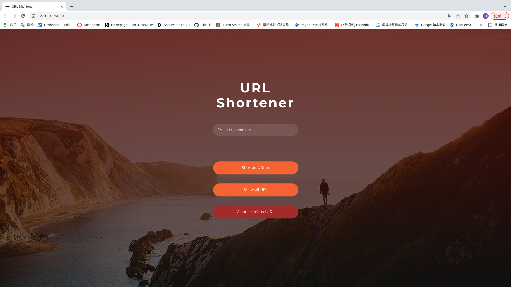

# Flask URL-Shortener

[//]: # ([Live Demo]&#40;https://glowsquid.com/url/&#41; &#40;on a not-so-short URL&#41;)

## Features

- A home page can create a shortened URLs to a default 3-digit prefix using a random character and letter combination.
- A Stats page shows all the shortened URLs, and it is able to modify and delete the shortened URLs.
- Use the shortened URL to redirect to the original long URL that match in the database.
- Checks if the shortened URL already exists and attempt to re-run the code-generator until it finds an available combination.
- All data is stored in a SQLite table.

## Setup

- Install the requirements `pip install -r requirements.txt`

Run the app with `python main.py`
